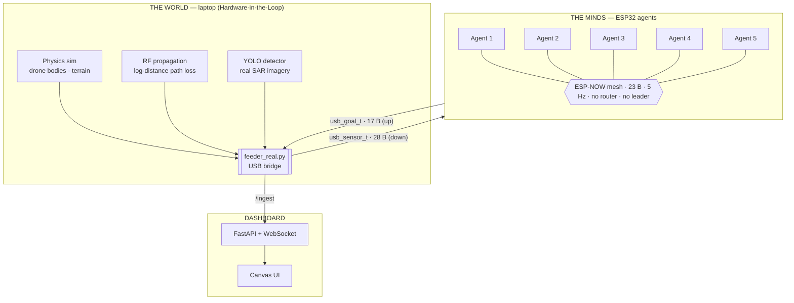
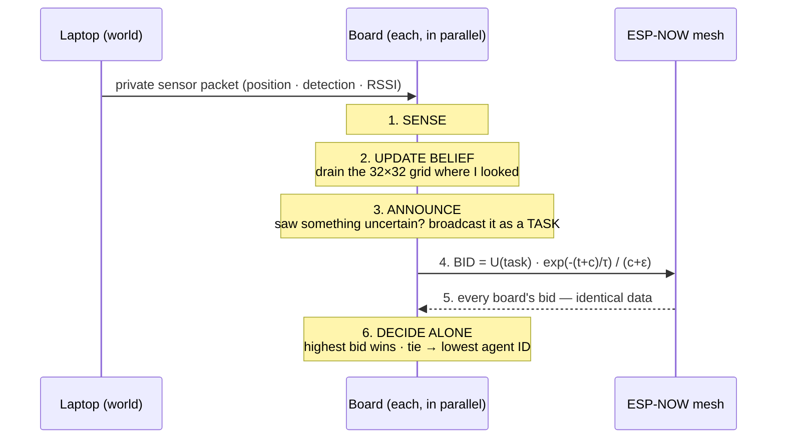
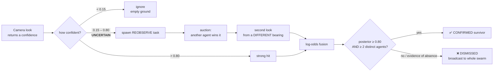

<div align="center">

# 🛰️ KHOJ

**A leaderless drone swarm that finds survivors in collapsed buildings — no GPS, no pilot, no central controller.**

*Khoj* (खोज) — "the search."


</div>

---

When a building collapses, the first 72 hours decide who lives. But inside rubble
there is **no GPS**, radios die behind concrete, and a single command drone is a
single point of failure. KHOJ takes the opposite approach: a swarm of cheap
boards that **coordinate with no leader**, find victims by **radio when cameras
can't see them**, and **refuse to report a survivor until two independent drones
agree**. Kill any drone mid-mission and the rest re-coordinate in under two
seconds.

**Three ideas in one line:** *Leaderless · GPS-denied · Self-confirming.*

## 📋 Table of Contents

- [Overview](#-overview)
- [System Architecture](#-system-architecture)
- [The Auction Round](#-the-auction-round--one-decision-no-leader)
- [Re-observation & Confirmation](#-re-observation--confirmation)
- [The Algorithms](#-the-algorithms)
- [Benchmarks & Performance](#-benchmarks--performance)
- [The Wire Contract](#-the-wire-contract)
- [Tech Stack](#-tech-stack)
- [Project Structure](#-project-structure)
- [Getting Started](#-getting-started)
- [Hardware](#-hardware)
- [Status & Roadmap](#-status--roadmap)
- [License](#-license)

* * *

## 🔍 Overview

KHOJ is an autonomous search-and-rescue swarm for **GPS-denied indoor disaster
zones**. It is built on an **asymmetric compute** model: one heavy "mother drone"
(Jetson) carries the vision model, while a mesh of $5 ESP32 boards does the
coordination. There is no central brain — every board runs the *identical*
decision logic and reaches the *same* conclusion from the *same* broadcast data,
so removing any board changes nothing about how the rest decide.

The whole system runs today as a **hardware-in-the-loop (HIL)** rig, captured in
one principle:

> **The laptop owns reality. The boards own the decisions. They never swap roles.**

The laptop simulates the world — each drone's body, what its camera sees, the
radio it hears — and streams that to each board over a private USB link. It
**never assigns work**. Every goal you see move on the dashboard was decided on a
separate microcontroller, from that board's own private belief, and agreed by
radio. That is what makes this a swarm and not a puppet show.

* * *

## 🗺️ System Architecture



Each board decides *who wins a task, how to climb an RF gradient, and whether a
sighting is confirmed*. The laptop only decides *where the body physically is,
what its camera sees, and — when a board has nothing to do — which blank cell to
explore next*. Sensing and actuation on the laptop; cognition on the boards.

* * *

## ⚖️ The Auction Round — one decision, no leader

Every ~500 ms, on every board, in parallel:



**Same data + same rule = same winner, computed independently on 5 chips.** No
board announces the result; no board is asked. There is no referee to kill —
which is exactly why killing any board changes nothing. *(Task-allocation class
ST-SR-IA, Gerkey & Matarić, solved by a sequential single-item auction.)*

One bid function serves every task type — value discounted by **travel time**,
not distance, because a survivor reached later is less likely alive:

| Task | Utility `U` |
|---|---|
| `FRONTIER` | `A · p · p_det` (explore blank space) |
| `REOBSERVE` | `H(p) · C_FN · viewpoint` (resolve an uncertain sighting) |
| `CONFIRM_RF` | `500` (highest — chase a radio hit no camera can see) |
| `RELAY` | keep the mesh connected |

**When a board dies:** heartbeats stop → after 2 s of silence every surviving
board independently marks it dead → its tasks fall back into the pool → the next
round re-auctions them. Recovery is emergent, not scripted. *(Verified on
hardware: detected in under 2 s, 5 boards.)*

* * *

## 🎯 Re-observation & Confirmation

A single camera look returns one confidence. What happens next depends entirely
on where it lands — and **one drone can never confirm a survivor by itself**.



This lets KHOJ run the detector at a **low threshold** — catching the half-buried
and occluded victims a normal system throws away — without flooding rescuers with
false alarms, because every marginal detection earns an independent second look
from a new angle. Dismissals are broadcast too (*"the individual forgets; the
swarm remembers"*), so no drone ever wastes a second look on a ruled-out lead.

> In search-and-rescue, a false positive costs three minutes. A false negative
> costs a life. This is why KHOJ divides **doubt**, not just work.

* * *

## 🧠 The Algorithms

| Component | What it does | Where it runs |
|---|---|---|
| **Leaderless auction** | Bids `expected information ÷ time-to-reach`; highest wins, ties → lowest ID. All boards converge on one winner with no auctioneer. | ESP32 + Python |
| **Log-odds belief fusion** | Independent detections add evidence in log-odds; confirm needs posterior ≥ 0.80 **and** ≥ 2 distinct agents — self-confirmation is impossible by construction. | ESP32 + Python |
| **Trust & quarantine** | Per-agent Beta reliability prior; a sensor whose claims keep getting dismissed is auto-benched. | Python |
| **RF localization** | Distributed RSSI gradient-ascent — hill-climbs to the strongest signal instead of trilaterating (which hallucinates through concrete). | ESP32 |
| **Failure detection** | 5 Hz heartbeat; dead peer recognized in < 2 s and its tasks re-auctioned. | ESP32 |

The auction and belief fusion exist as a **byte-identical port** — native C on
the boards, the same math in Python for the reference engine and dashboard.

* * *

## 📊 Benchmarks & Performance

| Metric | Result |
|---|---|
| **Survivors confirmed** (equal time budget) | **4.23** vs. greedy 1.67 / lawnmower 1.40 / random 2.63 |
| **False alarms** | **0** across 600 Monte-Carlo runs |
| **Detector accuracy** | mAP50 **0.934**, recall 0.875 (YOLOv11, real SAR imagery) |
| **Mesh reliability** | **0%** packet loss @ 5 Hz, 5 boards |
| **Failure detection** | dead peer recognized in **< 2 s** |
| **RF localization** | converges to **±0.3 grid cells** |

Reproduce the search numbers (pure stdlib, no install needed):

```bash
python -m scripts.metrics --seeds 30 --budget 60
```

* * *

## 🔌 The Wire Contract

Firmware and Python speak a **byte-identical** protocol —
`khoj/firmware/lib/quorum_proto/quorum_proto.h` ↔ `khoj/sim/protocol.py` —
packed little-endian structs with no padding:

| Frame | Direction | Size | Purpose |
|---|---|---|---|
| `quorum_msg_t` | board ↔ board (ESP-NOW) | **23 B** | bids · awards · heartbeats · RF samples |
| `usb_sensor_t` | laptop → board (USB) | **28 B** | position · detection · RSSI |
| `usb_goal_t` | board → laptop (USB) | **17 B** | chosen goal · state · task id |

* * *

## 🛠️ Tech Stack

| Layer | Technology |
|---|---|
| **Swarm engine** | Python 3 (standard library only — zero dependencies) |
| **Vision** | YOLOv11 (Ultralytics) → FP16 TensorRT engine on Jetson Orin |
| **Firmware** | C / PlatformIO, ESP-NOW mesh on ESP32 |
| **Backend** | FastAPI + WebSocket (10 Hz state) |
| **Frontend** | Canvas 2D dashboard (vanilla JS) |
| **Bridge** | `pyserial` USB HIL feeder |
| **Metrics** | NumPy + Matplotlib Monte-Carlo harness |

* * *

## 📁 Project Structure

```
KHOJ/
├── engine/       swarm auction, log-odds belief fusion, world sim, perception  (stdlib only)
├── detector/     YOLOv11 training, Jetson TensorRT export, live camera stream
├── khoj/         hardware stack
│   ├── firmware/     ESP-NOW mesh + on-device auction (C / PlatformIO)
│   └── sim/          feeder_real.py bridge · protocol.py · wire test
├── backend/      FastAPI + WebSocket state service (fake / real / hardware)
├── frontend/     Canvas dashboard (index.html, app.js, styles.css)
├── dashboard/    simulator state adapters and models
├── scripts/      metrics harness · matplotlib viewer · perception demo
├── tests/        backend & WebSocket checks
└── docs/         state-contract documentation
```

* * *

## 🚀 Getting Started

The **core engine is pure Python 3 stdlib** — it runs with no install. Everything
else installs from `requirements.txt`.

### Prerequisites

- Python 3.10+
- (optional) A GPU environment for the detector — see `detector/requirements.txt`

### Install

```bash
python -m pip install -r requirements.txt
```

### 1. Live dashboard

```bash
uvicorn backend.main:app --host 127.0.0.1 --port 8000
```
```bash
python -m http.server 3000 --bind 127.0.0.1 --directory frontend
```

Open <http://127.0.0.1:3000/>. Pick the state source with `KHOJ_ENGINE`:

| `KHOJ_ENGINE` | Source |
|---|---|
| `real` *(default)* | pure-Python swarm engine — no hardware |
| `fake` | mock generator for standalone frontend work |
| `hardware` | live ESP32 boards, fed over `/ingest` by the bridge |

### 2. Headless simulation & tools

```bash
python -m engine.run_sim --ticks 400                 # run the swarm, no dashboard
python -m scripts.viewer                              # matplotlib playback
python -m scripts.metrics --seeds 30 --budget 60     # benchmark vs baselines
```

### 3. Real detector on the Jetson

```bash
python3 detector/jetson_stream.py --engine ~/best.engine --source 0
# then open  http://192.168.55.1:8090  for the live annotated feed
```

### 4. Hardware-in-the-loop

Flash 5 boards, run the bridge, then start the dashboard in `hardware` mode:

```bash
python khoj/sim/feeder_real.py --ports COM3 COM13 COM14 COM16
```

* * *

## 🚁 Hardware

| Role | Board | Job |
|---|---|---|
| **Mother drone** | Jetson Orin + ArduCam | runs the YOLO TensorRT model — the only heavy brain |
| **Scouts** | ESP32 ×5 (ESP-NOW mesh) | on-device auction, belief, RF localization |
| **Data mule / cam scout** | Raspberry Pi + camera | store-and-forward when the mesh severs |

* * *

## 📈 Status & Roadmap

**Working today:** the swarm engine, the live dashboard, the metrics harness, and
the Jetson detector all run. The 5-board mesh — auction, belief, and failure
detection — runs on the bench.

**In progress:**

- [ ] Full end-to-end HIL: 5 boards + Jetson detector + dashboard together
- [ ] WiFi-promiscuous "digital sniffing" — detect a buried victim's phone probe requests
- [ ] Topological hop-count RF mapping for concrete-heavy interiors
- [ ] Indoor-domain detector (fine-tune on disaster imagery)

* * *

## 📄 License

Released under the [MIT License](LICENSE).

<div align="center">

Built for **INNOHACK 2.0** 🏆

</div>
